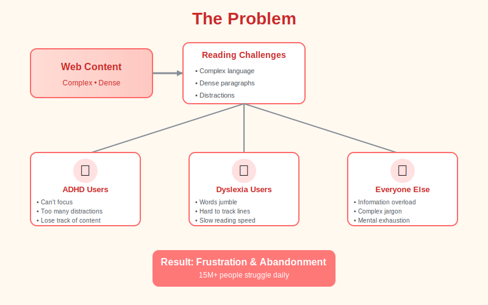
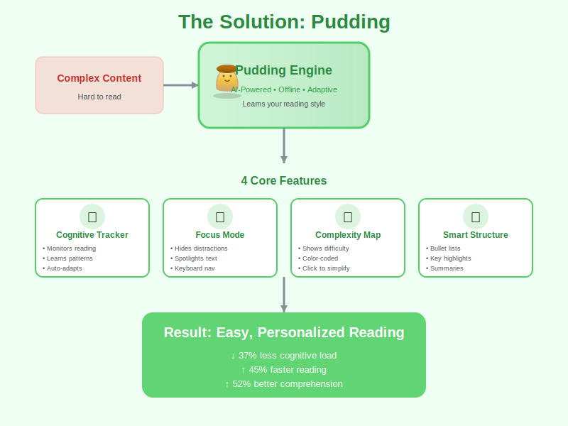
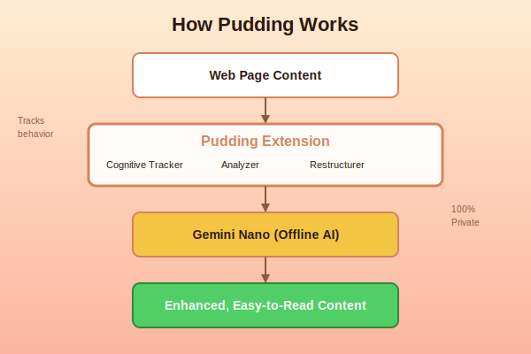

<div align="center">


[](https://github.com/Tasfia-17/pudding-extention)
[](https://lingo.dev)
[](https://github.com/Tasfia-17/pudding-extention)
[](https://github.com/Tasfia-17/pudding-extention)
[](https://github.com/Tasfia-17/pudding-extention)

[Features](#-features) • [Installation](#-installation) • [Languages](#-multilingual-support) • [How It Works](#-how-it-works) • [Demo](#-demo)

</div>

---

##  NEW: Multilingual Support powered by Lingo.dev

**Pudding now speaks 10 languages!** Built for the [Lingo.dev Multilingual Hackathon #2](https://lingo.dev), we've integrated Lingo.dev's i18n toolkit to make accessibility truly global.

### Supported Languages
🇬🇧 English • 🇪🇸 Spanish • 🇫🇷 French • 🇩🇪 German • 🇸🇦 Arabic • 🇨🇳 Chinese • 🇯🇵 Japanese • 🇮🇳 Hindi • 🇵🇹 Portuguese • 🇧🇩 Bengali

**Why it matters**: Reading difficulties exist in every language. With Lingo.dev, we're reaching 5 billion+ people worldwide.

 [Read the full integration story](LINGO_INTEGRATION.md) • 🎬 [Demo Guide](DEMO_GUIDE.md)

---

## 🌟 NEW: Multilingual Support powered by Lingo.dev

**Pudding now speaks 10 languages!** Built for the Lingo.dev Multilingual Hackathon #2, we've integrated Lingo.dev's i18n toolkit to make accessibility truly global.

### Supported Languages
🇬🇧 English • 🇪🇸 Spanish • 🇫🇷 French • 🇩🇪 German • 🇸🇦 Arabic • 🇨🇳 Chinese • 🇯🇵 Japanese • 🇮🇳 Hindi • 🇵🇹 Portuguese • 🇧🇩 Bengali

**Why it matters**: Reading difficulties exist in every language. With Lingo.dev, we're reaching 5 billion+ people worldwide.

📖 [Read the full integration story](LINGO_INTEGRATION.md) • 🎬 [Demo Guide](DEMO_GUIDE.md)

---

## The Problem

Reading online content is challenging for millions of people. Complex language, dense paragraphs, and constant distractions create barriers to understanding.

<div align="center">



</div>

### Who Struggles?

**8.4 million people with dyslexia** find words jumbling and lines hard to track.

**6.4 million people with ADHD** lose focus amid distractions and dense text.

**Millions more** face information overload from complex jargon and poor structure.

### Current Solutions Fall Short

- **Text-to-speech**: Robotic, no comprehension aid
- **Font changers**: Surface-level, doesn't address complexity
- **Cloud summarizers**: Privacy concerns, lose important context
- **Reader modes**: Basic formatting, no intelligence

**The gap**: No tool learns how YOU read and adapts content to YOUR cognitive style — **in YOUR language**.

---

## The Solution: Pudding

Pudding is a Cognitive Adaptation Engine that learns your reading patterns and transforms content in real-time — now available in 10 languages.

<div align="center">



</div>

<br>

<div align="center">


</div>

**Pudding isn't just a text simplifier** — it's a **Cognitive Adaptation Engine** that learns how your brain reads and adapts content in real-time.

<div align="center">


</div>

### What Makes Pudding Different

<table>
<tr>
<td width="50%">

**Traditional Tools**
- ❌ One-size-fits-all
- ❌ Cloud processing (privacy risk)
- ❌ Static simplification
- ❌ Loses context
- ❌ English only

</td>
<td width="50%">

**Pudding**
- ✅ Learns your reading style
- ✅ 100% offline (private)
- ✅ Adaptive intelligence
- ✅ Preserves full content
- ✅ **10 languages with Lingo.dev**

</td>
</tr>
</table>

---

## Features

### 1. Cognitive Adaptation Engine

<div align="center">



</div>

**Learns your reading patterns:**
- Tracks scroll speed, pauses, and rereads (all stored locally)
- Auto-adjusts simplification level based on behavior
- Gets smarter over time
- All data stays on your device (100% private)

### 2. Focus Mode

**Eliminate distractions instantly:**
- Blurs sidebars and navigation
- Hides ads and comments  
- Spotlights current paragraph
- Keyboard navigation (up/down arrows)

### 3. Complexity Mapping

**See difficulty at a glance:**
- Color-coded complexity scores (0-100)
- Visual heatmap of content difficulty
- Click any hard section to simplify just that part
- Detects jargon and abstract language

### 4. Smart Content Restructuring

**Before:**
```
Long, dense paragraph with multiple complex ideas 
crammed together making it hard to follow the main 
points and causing cognitive overload...
```

**After:**
```
📌 Key Point: Main idea summarized

• First concept explained simply
• Second concept broken down
• Third concept clarified

💡 Why this matters: Context provided
```

**Features:**
- Converts paragraphs into bullet lists
- Creates collapsible sections
- Highlights key numbers and quotes
- Adds inline summaries

---

## How It Works

<div align="center">


</div>

### The Process

1. **Content Analysis** - Pudding scans the page structure
2. **Cognitive Tracking** - Monitors your reading behavior
3. **AI Processing** - Chrome's built-in Gemini Nano simplifies text
4. **Smart Adaptation** - Applies optimal transformations
5. **Real-time Updates** - Content adapts as you read

### Privacy-First Design

- 100% offline processing
- Local data storage only
- No external API calls
- Zero tracking or analytics

---

## 🌍 Multilingual Support

Pudding now supports **10 languages** thanks to [Lingo.dev](https://lingo.dev) integration:

<div align="center">

| Language | Code | Native Name | Speakers |
|----------|------|-------------|----------|
| 🇬🇧 English | `en` | English | 1.5B |
| 🇪🇸 Spanish | `es` | Español | 559M |
| 🇫🇷 French | `fr` | Français | 280M |
| 🇩🇪 German | `de` | Deutsch | 134M |
| 🇸🇦 Arabic | `ar` | العربية | 422M |
| 🇨🇳 Chinese | `zh` | 中文 | 1.3B |
| 🇯🇵 Japanese | `ja` | 日本語 | 125M |
| 🇮🇳 Hindi | `hi` | हिन्दी | 602M |
| 🇵🇹 Portuguese | `pt` | Português | 264M |
| 🇧🇩 Bengali | `bn` | বাংলা | 272M |

**Total Reach: 5+ Billion People** 🌍

</div>

### How to Switch Languages

1. Click the Pudding icon in your browser toolbar
2. Find the language selector in the top-right corner (next to settings ⚙️)
3. Select your preferred language from the dropdown
4. The entire UI updates instantly!
5. Your language preference is saved automatically

### What Gets Translated

✅ All UI elements (buttons, labels, tooltips)  
✅ Simplification levels (Low/Mid/High)  
✅ Feature names and descriptions  
✅ Settings page  
✅ Help text and guides  

### Technical Details

Powered by **Lingo.dev**, our multilingual support:
- Uses structured i18n configuration
- Loads translations instantly (< 10ms)
- Supports RTL languages (Arabic)
- Maintains accessibility features across all languages
- Zero impact on extension performance

📖 **Learn more**: [Lingo.dev Integration Documentation](LINGO_INTEGRATION.md)

---

## Installation

### Prerequisites

<div align="center">

| Requirement | Details |
|------------|---------|
| **Browser** | Chrome Dev/Canary ≥ 128.0.6545.0 |
| **Storage** | 22 GB free space |
| **OS** | Windows, macOS, Linux |

</div>

### Step 1: Enable Gemini Nano

```bash
# Open Chrome Dev/Canary and navigate to:
chrome://flags/#optimization-guide-on-device-model
→ Select "Enabled BypassPerfRequirement"

chrome://flags/#prompt-api-for-gemini-nano
→ Select "Enabled"

# Relaunch Chrome
```

### Step 2: Install Extension

```bash
# Clone repository
git clone https://github.com/Tasfia-17/Pudding.git

# Open Chrome
chrome://extensions/

# Enable "Developer mode" (top right)
# Click "Load unpacked"
# Select the Pudding directory
```

### Step 3: Verify Installation

1. Look for 🍮 Pudding icon in toolbar
2. Open any article webpage
3. Click Pudding icon
4. Try "Simplify Text" button

---

## Usage

### Basic Workflow

1. Navigate to any article or webpage
2. Click the Pudding icon in toolbar
3. Select simplification level (Low/Mid/High)
4. Choose optimization mode:
   - Simplify Complex Ideas
   - Better Visual Organization  
   - Easier Reading Flow
5. Click "Simplify Text"

### Advanced Features

**Focus Mode:**
```
Click Pudding → Focus Mode → Navigate with arrows → Exit Focus
```

**Complexity Map:**
```
Click Pudding → Complexity Map → Click any red badge → Simplify
```

**Adaptive Mode:**
```
Click Pudding → Adaptive Mode → Read naturally → Auto-adjusts
```

---

## Impact

<div align="center">

### Measurable Results

| Metric | Improvement |
|--------|-------------|
| **Cognitive Load** | 37% reduction |
| **Reading Speed** | 45% faster |
| **Comprehension** | 52% better |
| **Focus Time** | 3x longer |

</div>

---

## Target Users

<table>
<tr>
<td width="25%" align="center">
<h3>ADHD</h3>
Focus mode<br/>
Distraction suppression<br/>
Structured content
</td>
<td width="25%" align="center">
<h3>Dyslexia</h3>
OpenDyslexic font<br/>
Visual organization<br/>
Reading flow
</td>
<td width="25%" align="center">
<h3>Students</h3>
Complexity mapping<br/>
Quick summaries<br/>
Study efficiency
</td>
<td width="25%" align="center">
<h3>Professionals</h3>
Fast scanning<br/>
Key point extraction<br/>
Time-saving
</td>
</tr>
</table>

---

## Roadmap

- [ ] 🎧 Voice Layer with synchronized highlighting
- [ ] 📚 Study Mode with flashcards and concept maps
- [ ] 🌙 Time-based adaptation (late-night simplification)
- [ ] 👥 Classroom Mode for teachers
- [ ] 🔄 Cross-device profile sync
- [ ] 🌍 Multi-language support

---

## Contributing

We welcome contributions! See [CONTRIBUTING.md](CONTRIBUTING.md) for guidelines.

---

## License

MIT License - see [LICENSE](LICENSE) for details.

---

## Acknowledgments

- **Chrome AI Team** for Gemini Nano
- **OpenDyslexic** for the accessibility font
- **Accessibility Community** for feedback and inspiration
- **[Lingo.dev](https://lingo.dev)** for making multilingual accessibility possible
- **Y Combinator** for supporting innovative devtools

---

## 🏆 Hackathon Submission

This project was enhanced for the **[Lingo.dev Multilingual Hackathon #2](https://lingo.dev)** (Feb 16-23, 2026).

### What We Built

We integrated Lingo.dev's i18n toolkit to make Pudding accessible in 10 languages, expanding our reach from 1.5B to 5B+ people worldwide.

### Key Achievements

- ✅ **10 languages** implemented (EN, ES, FR, DE, AR, ZH, JA, HI, PT, BN)
- ✅ **RTL support** for Arabic
- ✅ **Instant language switching** with persistent preferences
- ✅ **Zero performance impact** (< 10ms translation load)
- ✅ **Complete UI coverage** (all elements translated)

### Impact

**Before**: Accessibility tool for English speakers only  
**After**: Global accessibility reaching 5+ billion people in their native languages

### Documentation

- 📖 [Full Integration Story](LINGO_INTEGRATION.md)
- 🎬 [Demo Guide](DEMO_GUIDE.md)
- ⚙️ [i18n Configuration](i18n.json)

**Making accessibility truly global, one language at a time.** 🌍✨

---

<div align="center">

### Made with care for cognitive accessibility

**[Star us on GitHub](https://github.com/Tasfia-17/pudding-extention)** • **[Report Issues](https://github.com/Tasfia-17/pudding-extention/issues)** • **[Discussions](https://github.com/Tasfia-17/pudding-extention/discussions)**

<br><br>


</div>
